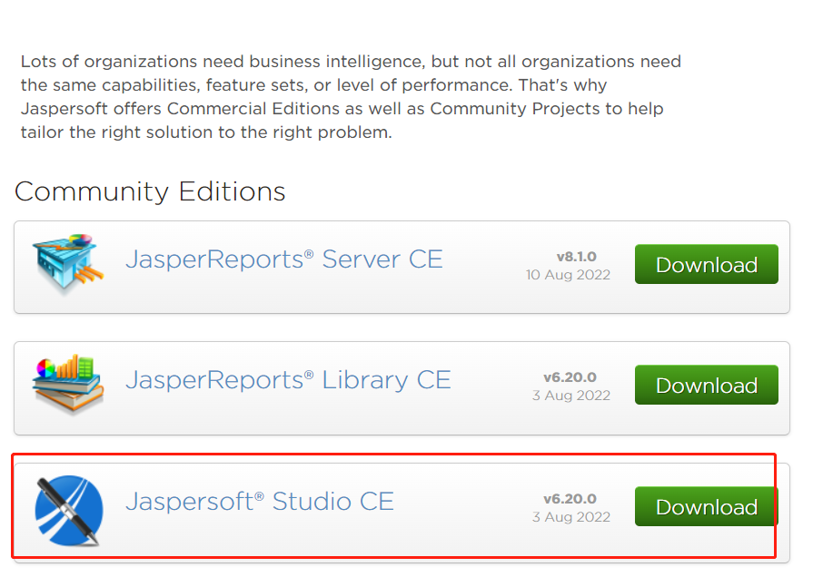

## JasperReport（简称js）入门教程 代码示例

>[原工程作者博客教程地址](https://www.cnblogs.com/xyyz120/category/1695447.html)

>[JasperReport Studio下载地址](https://community.jaspersoft.com/community-download)

**本仓库在原demo中作了以下变更：**
1. JasperReport依赖的iText是JasperReport他们自己修改了的，可以在他们的私服里下载到[iText2 js版本](https://jaspersoft.jfrog.io/ui/native/third-party-ce-artifacts/com/lowagie/itext)
2. 直接用maven仓库中的iText 2.1.7，会有`Unpatched iText found, cannot use glyph rendering`的警告，可以用以上JasperReport的js版本，maven中用`<systemPath>`处理
